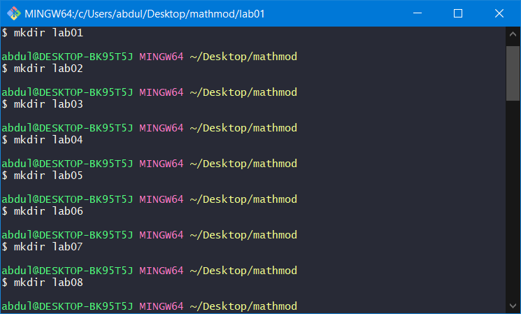
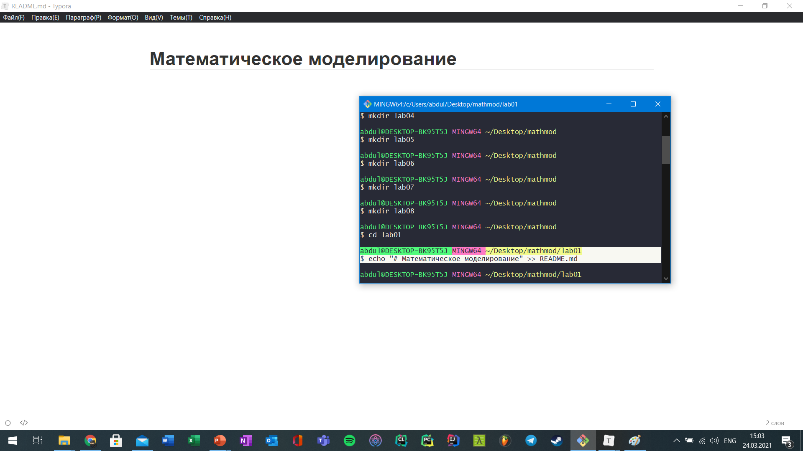
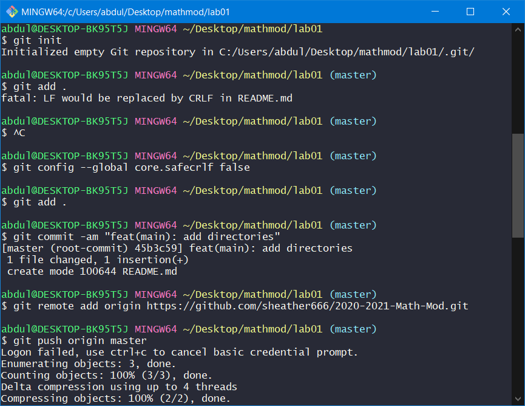
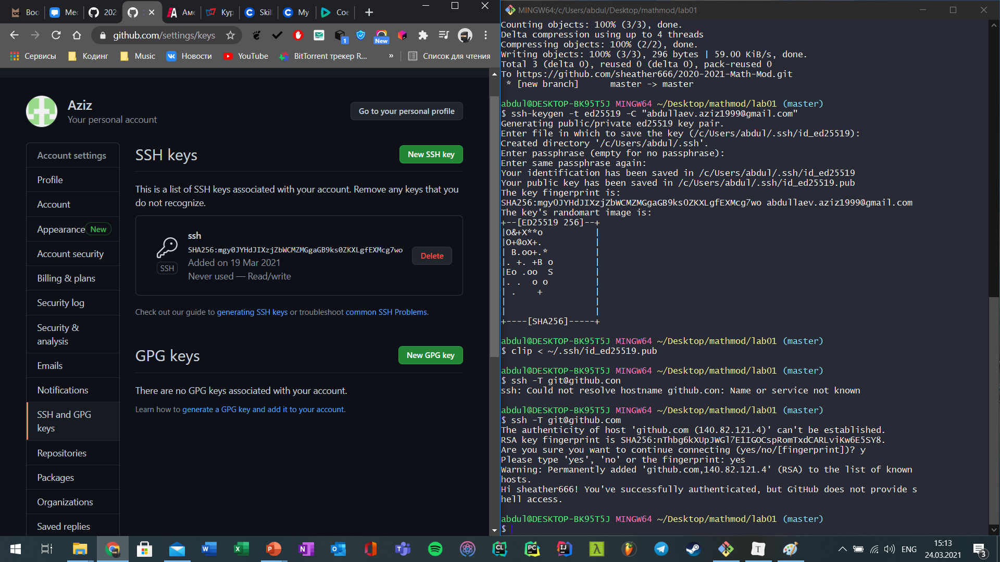

---
# Front matter
lang: ru-RU
title: "Отчет по лабораторной работе 1"
subtitle: "дисциплина: Математическое моделирование"
author: "Абдуллаев Сайидазизхон Шухратович"

# Formatting
toc-title: "Содержание"
toc: true # Table of contents
toc_depth: 2
lof: true # List of figures
lot: true # List of tables
fontsize: 12pt
linestretch: 1.5
papersize: a4paper
documentclass: scrreprt
polyglossia-lang: russian
polyglossia-otherlangs: english
mainfont: PT Serif
romanfont: PT Serif
sansfont: PT Sans
monofont: PT Mono
mainfontoptions: Ligatures=TeX
romanfontoptions: Ligatures=TeX
sansfontoptions: Ligatures=TeX,Scale=MatchLowercase
monofontoptions: Scale=MatchLowercase
indent: true
pdf-engine: lualatex
header-includes:
  - \linepenalty=10 # the penalty added to the badness of each line within a paragraph (no associated penalty node) Increasing the value makes tex try to have fewer lines in the paragraph.
  - \interlinepenalty=0 # value of the penalty (node) added after each line of a paragraph.
  - \hyphenpenalty=50 # the penalty for line breaking at an automatically inserted hyphen
  - \exhyphenpenalty=50 # the penalty for line breaking at an explicit hyphen
  - \binoppenalty=700 # the penalty for breaking a line at a binary operator
  - \relpenalty=500 # the penalty for breaking a line at a relation
  - \clubpenalty=150 # extra penalty for breaking after first line of a paragraph
  - \widowpenalty=150 # extra penalty for breaking before last line of a paragraph
  - \displaywidowpenalty=50 # extra penalty for breaking before last line before a display math
  - \brokenpenalty=100 # extra penalty for page breaking after a hyphenated line
  - \predisplaypenalty=10000 # penalty for breaking before a display
  - \postdisplaypenalty=0 # penalty for breaking after a display
  - \floatingpenalty = 20000 # penalty for splitting an insertion (can only be split footnote in standard LaTeX)
  - \raggedbottom # or \flushbottom
  - \usepackage{float} # keep figures where there are in the text
  - \floatplacement{figure}{H} # keep figures where there are in the text
---

# Цель работы

Знакомство с Git и языком MarkDown

# Задание

- Создать репозиторий и файл README.md
- Загрузить созданный файл в репозиторий
- Настроить SSH ключ

# Выполнение лабораторной работы

1. Создал каталоги для лабораторных работ   (рис. -@fig:001)

   { #fig:001 width=70% }

2. Создал репозиторий на GitHub (рис. -@fig:002)

   { #fig:002 width=70% }

3. Создал файл README.md в который поместил запись "# Математическое моделирование" (рис. -@fig:003)

   { #fig:003 width=70% }

4. Подгрузил файл в репозиторий. Сначала проинициализировал каталог *git init*, далее добавил файлы *git add .*, далее сделал *git commit* после чего сделал remote на нужную ветку и запушил (рис. -@fig:004)

   { #fig:004 width=70% }

5. Сгенерировал ssh ключ и подключился по этому ключу (рис. -@fig:005)

   { #fig:005 width=70% }

# Выводы

Начал изучение Git и языка MarkDown

Видео-отчет по данной лабораторной работе [ТУТ](https://youtu.be/79_fuZuYJVs): https://youtu.be/79_fuZuYJVs

Ссылка на GitHub: [link](https://github.com/sheather666/2020-2021-Math-Mod)