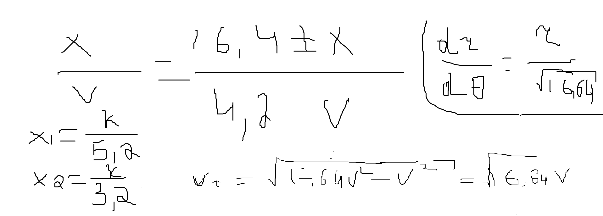
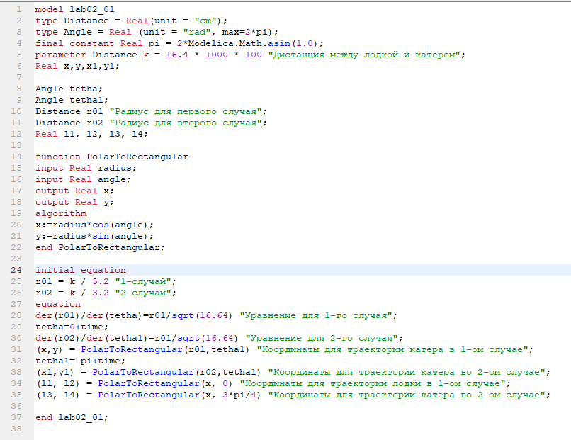
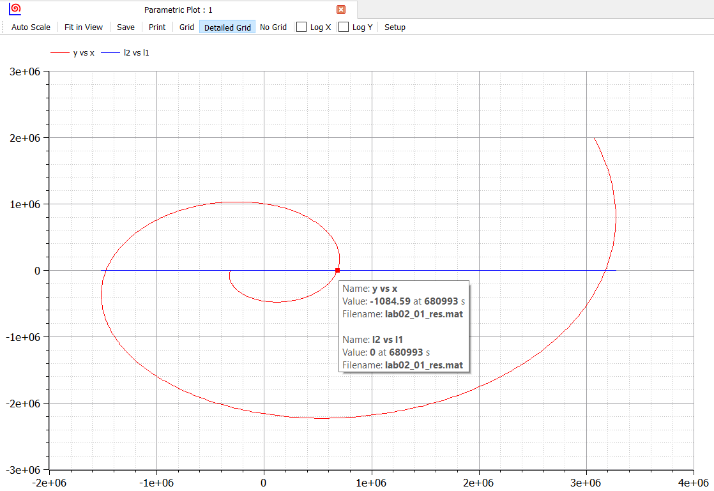
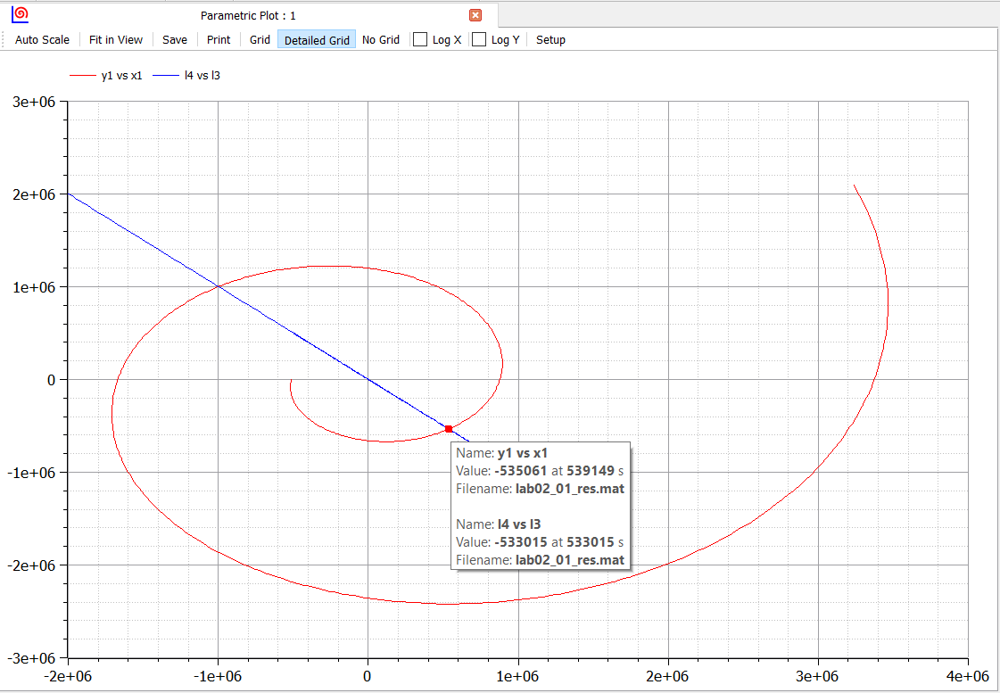

---
## Front matter
lang: ru-RU
title: "Отчет по лабораторной работе 2"
subtitle: "Дисциплина: Математическое моделирование"
author: "Абдуллоев Сайидазизхон Шухратович, НПИ-02-18"

## Formatting
toc: false
slide_level: 2
theme: metropolis
header-includes:
 - \metroset{progressbar=frametitle,sectionpage=progressbar,numbering=fraction}
 - '\makeatletter'
 - '\beamer@ignorenonframefalse'
 - '\makeatother'
aspectratio: 43
section-titles: true

---

# Прагматика выполнения лабораторной работы

## Зачем?

Данная лабораторная работа была выполнена для получения знаний в области математического моделирования и решения задачи о погоне.

## Цель

Решить задачу о погоне, построить графики с помощью Modelica

# **Задачи выполнения лабораторной работы**

## Вариант 45

На море в тумане катер береговой охраны преследует лодку браконьеров.
Через определенный промежуток времени туман рассеивается, и лодка обнаруживается 
на расстоянии 16,4 км от катера. Затем лодка снова скрывается в тумане и уходит 
прямолинейно в неизвестном направлении. Известно, что скорость катера в 4,2 раза 
больше скорости браконьерской лодки.

## Задание

1. Вывести дифференциальное уравнение, описывающее движение катера, с начальными условиями.
2. Построить траектории движения катера и лодки для двух случаев.
3. Определить точку пересечения катера и лодки.

## Выполнение лабораторной работы

- Вывод дифференциальных уравнений, если скорость катера больше скорости лодки в 4.2 раз.

$\frac{dr}{d\theta} = \frac{r}{\sqrt{16.64}}$, где первый случай начальных условий
$\begin{cases}
    \theta_{0} = 0 \\
    r_{0}=\frac{k}{5.2}
  \end{cases}$
, а второй случай

$\begin{cases}
    \theta_{0} = -\pi \\
    r_{0}=\frac{k}{3.2}
  \end{cases}$
(рис. -@fig:001)

{#fig:001 width=70%}

## Выполнение лабораторной работы

- Построить траекторию движения катера и лодки для двух случаев.

Построил модель в Modelica (рис. -@fig:002)

{#fig:002 width=70%}

## Выполнение лабораторной работы

- Определить по графику точку пересечения катера и лодки для первого случая.

(рис. -@fig:003).

{#fig:003 width=70%}

## Выполнение лабораторной работы
- Определить по графику точку пересечения катера и лодки для второго случая.

 (рис. -@fig:004)

{#fig:004 width=70%}

## Вывод

Решил задачу о погоне, построил графики с помощью Modelica
