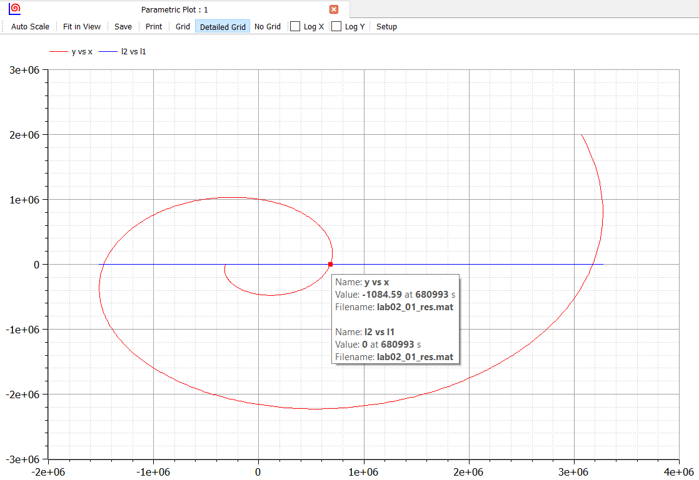

---
# Front matter
lang: ru-RU
title: "Отчёт по лабораторной работе 2"
subtitle: "дисциплина: Математическое моделирование"
author: "Абдуллоев Сайидазизхон Шухратович, НПИбд-02-18"

# Formatting
toc-title: "Содержание"
toc: true # Table of contents
toc_depth: 2
lof: true # List of figures
lot: true # List of tables
fontsize: 12pt
linestretch: 1.5
papersize: a4paper
documentclass: scrreprt
polyglossia-lang: russian
polyglossia-otherlangs: english
mainfont: PT Serif
romanfont: PT Serif
sansfont: PT Sans
monofont: PT Mono
mainfontoptions: Ligatures=TeX
romanfontoptions: Ligatures=TeX
sansfontoptions: Ligatures=TeX,Scale=MatchLowercase
monofontoptions: Scale=MatchLowercase
indent: true
pdf-engine: lualatex
header-includes:
  - \linepenalty=10 # the penalty added to the badness of each line within a paragraph (no associated penalty node) Increasing the value makes tex try to have fewer lines in the paragraph.
  - \interlinepenalty=0 # value of the penalty (node) added after each line of a paragraph.
  - \hyphenpenalty=50 # the penalty for line breaking at an automatically inserted hyphen
  - \exhyphenpenalty=50 # the penalty for line breaking at an explicit hyphen
  - \binoppenalty=700 # the penalty for breaking a line at a binary operator
  - \relpenalty=500 # the penalty for breaking a line at a relation
  - \clubpenalty=150 # extra penalty for breaking after first line of a paragraph
  - \widowpenalty=150 # extra penalty for breaking before last line of a paragraph
  - \displaywidowpenalty=50 # extra penalty for breaking before last line before a display math
  - \brokenpenalty=100 # extra penalty for page breaking after a hyphenated line
  - \predisplaypenalty=10000 # penalty for breaking before a display
  - \postdisplaypenalty=0 # penalty for breaking after a display
  - \floatingpenalty = 20000 # penalty for splitting an insertion (can only be split footnote in standard LaTeX)
  - \raggedbottom # or \flushbottom
  - \usepackage{float} # keep figures where there are in the text
  - \usepackage{amsmath}
  - \floatplacement{figure}{H} # keep figures where there are in the text
---

# Цель работы

Решить задачу о погоне, построить графики с помощью Modelica.

# Задание

**Вариант 45**
На море в тумане катер береговой охраны преследует лодку браконьеров.
Через определенный промежуток времени туман рассеивается, и лодка обнаруживается 
на расстоянии 16,4 км от катера. Затем лодка снова скрывается в тумане и уходит 
прямолинейно в неизвестном направлении. Известно, что скорость катера в 4,2 раза 
больше скорости браконьерской лодки.

1. Вывести дифференциальное уравнение, описывающее движение катера, с начальными условиями.
2. Построить траектории движения катера и лодки для двух случаев.
3. Определить точку пересечения катера и лодки.


# Выполнение лабораторной работы

**1. Вывод дифференциального уравнения**

1.1. Принимаем за $t_{0} = 0$, $x_{Л0} = 0$ -- место нахождения лодки браконьеров 
в момент обнаружения, $x_{К0} = 16,4$ км -- место нахождения катера береговой охраны 
относительно лодки браконьеров в момент обнаружения лодки.

1.2. Введем полярные координаты. Считаем, что полюс – это точка обнаружения лодки 
браконьеров $x_{Л0} (θ = x_{Л0} = 0)$, а полярная ось $r$ проходит через точку нахождения 
катера береговой охраны. (см. рис. -@fig:001)

{ #fig:001 width=70% }

1.3. Траектория катера должна быть такой, чтобы и катер, и лодка все время были 
на одном расстоянии от полюса $θ$, только в этом случае траектория катера пересечется с 
траекторией лодки. Поэтому для начала катер береговой охраны должен двигаться некоторое 
время прямолинейно, пока не окажется на том же расстоянии от полюса, что и лодка браконьеров. 
После этого катер береговой охраны должен двигаться вокруг полюса удаляясь от него с той же 
скоростью, что и лодка браконьеров.

1.4. Чтобы найти расстояние x (расстояние, после которого катер начнет двигаться 
вокруг полюса), необходимо составить простое уравнение. Пусть через время $t$ катер и лодка 
окажутся на одном расстоянии x от полюса. За это время лодка пройдет $x$, а катер $16.4 - x$ (или 
$16.4 + x$, в зависимости от начального положения катера относительно полюса). Время, за которое 
они пройдут это расстояние, вычисляется как $\frac{x}{v}$ или $\frac{16.4 - x}{4.2 * v}$ (во втором 
случае $\frac{16.4 + x}{4.2 * v}$). Так как время одно и то же, то эти величины одинаковы. Тогда 
неизвестное расстояние $x$ можно найти из следующего(-их) уравнения(-й):
$$ \frac{x}{v} = \frac{16.4-x}{4.2 * v}$$
$$ \frac{x}{v} = \frac{16.4+x}{4.2v}$$

Тогда $x_{1} = \frac{k}{5.2}$(км), а $x_{2} = \frac{k}{3.2}$(км), задачу будем 
решать для двух случаев.

1.5. После того, как катер береговой охраны окажется на одном расстоянии от полюса, что и лодка, он 
должен сменить прямолинейную траекторию и начать двигаться вокруг полюса удаляясь от него со скоростью 
лодки $v$. Для этого скорость катера раскладываем на две составляющие: $v_{r}$ – радиальная скорость и 
$v_{τ}$ – тангенциальная скорость. (см. рис. -@fig:002)

{ #fig:002 width=70% }

Радиальная скорость – это скорость, с которой катер удаляется от полюса, $v_{r} = \frac{\partial r}{\partial t}$. Нам 
нужно, чтобы эта скорость была равна скорости лодки, поэтому полагаем $v_{r} = \frac{\partial r}{\partial t} = v$.

Тангенциальная скорость – это линейная скорость вращения катера относительно полюса. Она равна 
произведению угловой скорости на радиус, $v_{τ} = r\frac{\partial θ}{\partial t}$.

Из рис. -@fig:002 по теореме Пифагора: $v_{τ} = \sqrt{17,64v^2 - v^2} = \sqrt{16,64}v$, тогда
получаем $r\frac{\partial θ}{\partial t} = \frac{\sqrt{16.64}}v$.

1.6. Решение исходной задачи сводится к решению системы из двух дифференциальных уравнений:
\begin{equation*} 
  \begin{cases} 
    \frac{\partial r}{\partial t} = v 
    \\
    r\frac{\partial θ}{\partial t} = \frac{\sqrt{16.64}}v 
  \end{cases}
\end{equation*} 

Исключая из полученной системы производную по t, можно перейти к следующему уравнению:
$$ \frac{\partial r}{\partial θ} = \frac{r}{\sqrt{16.64}} $$

Решив это уравнение, я получу траекторию движения катера в полярных координатах. Начальные условия:
\begin{equation*}
  \begin{cases}
    θ_{0} = 0 
    \\ 
    r_{0} = x_{1} = \frac{k}{5.2}
  \end{cases}
\end{equation*}

\begin{equation*}
  \begin{cases}
    θ_{0} = - $/pi$ 
    \\ 
    r_{0} = x_{2} = \frac{k}{3.2}k
  \end{cases}
\end{equation*} 

**2. Построение траекторий движения катера и лодки**

2.1. Написал программу на OpenModelica:

```Modelica
model lab02_01
type Distance = Real(unit = "cm");
type Angle = Real (unit = "rad", max=2*pi);
final constant Real pi = 2*Modelica.Math.asin(1.0);
parameter Distance k = 16.4 * 1000 * 100 "Дистанция между лодкой и катером"; 
Real x,y,x1,y1;

Angle tetha;
Angle tetha1;
Distance r01 "Радиус для первого случая";
Distance r02 "Радиус для второго случая";
Real l1, l2, l3, l4;

function PolarToRectangular
input Real radius;
input Real angle;
output Real x;
output Real y;
algorithm
x:=radius*cos(angle);
y:=radius*sin(angle);
end PolarToRectangular;

initial equation
r01 = k / 5.2 "1-случай"; 
r02 = k / 3.2 "2-случай";
equation
der(r01)/der(tetha)=r01/sqrt(16.64) "Уравнение для 1-го случая";
tetha=0+time;
der(r02)/der(tetha1)=r01/sqrt(16.64) "Уравнение для 2-го случая";
(x,y) = PolarToRectangular(r01,tetha1) "Координаты для траектории катера в 1-ом случае";
tetha1=-pi+time;
(x1,y1) = PolarToRectangular(r02,tetha1) "Координаты для траектории катера во 2-ом случае";
(l1, l2) = PolarToRectangular(x, 0) "Координаты для траектории лодки в 1-ом случае";
(l3, l4) = PolarToRectangular(x, 3*pi/4) "Координаты для траектории катера во 2-ом случае";

end lab02_01;

```

2.2. Получил следующие графики:(см. рис. -@fig:003 и -@fig:004)

{ #fig:003 width=70% }

{ #fig:004 width=70% }


# Выводы

Решил задачу о погоне, построила графики с помощью Modelica.
