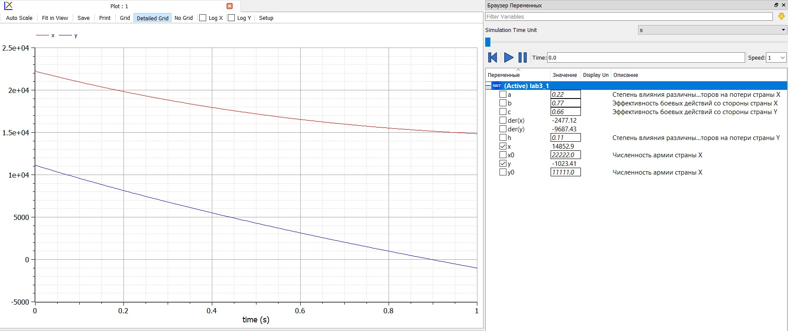
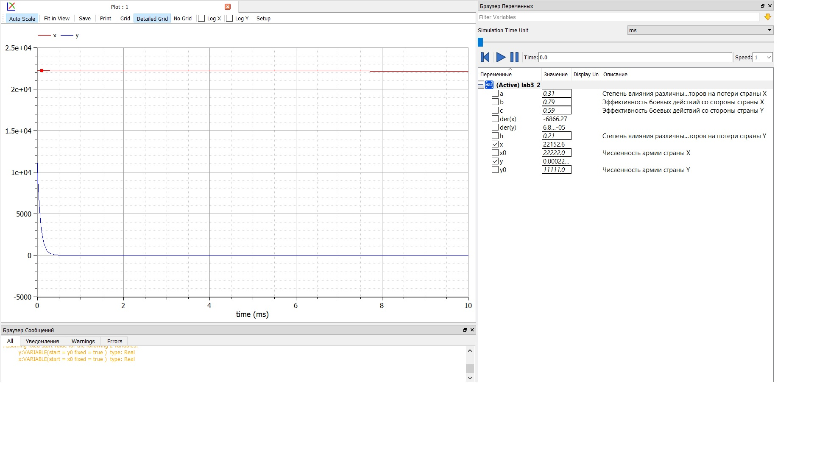

---
## Front matter
lang: ru-RU
title: "Отчет по лабораторной работе 3"
subtitle: "Дисциплина: Математическое моделирование"
author: "Абдуллоев Сайидазизхон Шухратович, НПИбд-02-18"

## Formatting
toc: false
slide_level: 2
theme: metropolis
header-includes:
 - \metroset{progressbar=frametitle,sectionpage=progressbar,numbering=fraction}
 - '\makeatletter'
 - '\beamer@ignorenonframefalse'
 - '\makeatother'
aspectratio: 43
section-titles: true
---

## Цель выполнения лабораторной работы

Изучить и построить математические модели боевых действий

## Задачи выполнения лабораторной работы

- Построить графики изменения численности войск армии страны X и страны Y для боевых действий между регулярными войсками (рис. -@fig:001) $$ \frac{\partial x}{\partial t} = -0.22x(t) - 0.77y(t) + sin(0.5t) + 2 $$ $$ \frac{\partial y}{\partial t} = -0.66x(t) - 0.11y(t) + cos(0.5t) + 2 $$ 
- Построить графики изменения численности войск армии *X* и армии *Y* для боевых действий с участием регулярных войск и партизанских отрядов. (рис. -@fig:004) $$ \frac{\partial x}{\partial t} = -0.31x(t) - 0.79y(t) + sin(2.5t) + 1$$ $$ \frac{\partial y}{\partial t} = -0.59x(t)y(t) - 0.21y(t) + cos(2t) + 2$$.

## Графики

{#fig:001 width=70%}

## Графики

{ #fig:004 width=70% }

## Результаты выполнения лабораторной  работы

Построил математические модели для двух случаев сражений и графики изменения численности войск для этих случаев

## {.standout}

GitHub:https://github.com/sheather666/2020-2021-Math-Mod

YouTube: https://youtu.be/5-iVcAr8S1Y