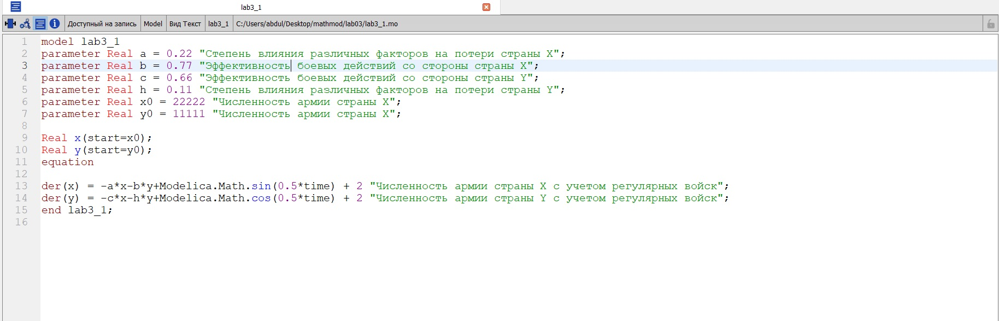
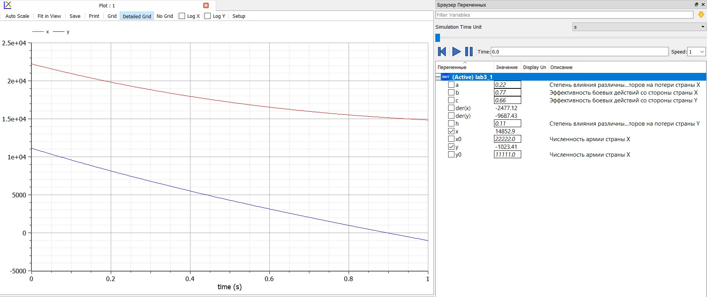
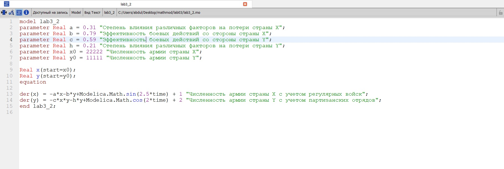
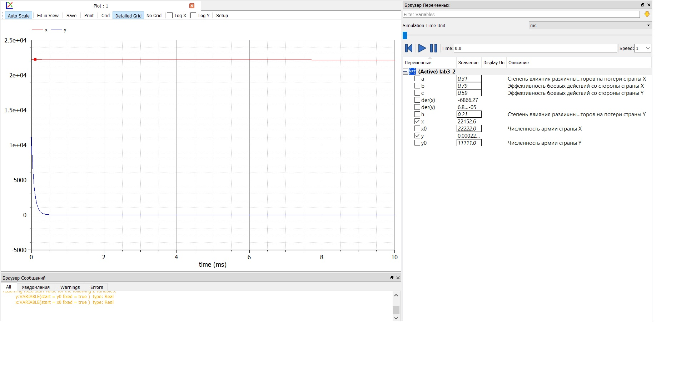

---
# Front matter
lang: ru-RU
title: "Отчет по лабораторной работе 1"
subtitle: "дисциплина: Математическое моделирование"
author: "Абдуллаев Сайидазизхон Шухратович"

# Formatting
toc-title: "Содержание"
toc: true # Table of contents
toc_depth: 2
lof: true # List of figures
lot: true # List of tables
fontsize: 12pt
linestretch: 1.5
papersize: a4paper
documentclass: scrreprt
polyglossia-lang: russian
polyglossia-otherlangs: english
mainfont: PT Serif
romanfont: PT Serif
sansfont: PT Sans
monofont: PT Mono
mainfontoptions: Ligatures=TeX
romanfontoptions: Ligatures=TeX
sansfontoptions: Ligatures=TeX,Scale=MatchLowercase
monofontoptions: Scale=MatchLowercase
indent: true
pdf-engine: lualatex
header-includes:
  - \linepenalty=10 # the penalty added to the badness of each line within a paragraph (no associated penalty node) Increasing the value makes tex try to have fewer lines in the paragraph.
  - \interlinepenalty=0 # value of the penalty (node) added after each line of a paragraph.
  - \hyphenpenalty=50 # the penalty for line breaking at an automatically inserted hyphen
  - \exhyphenpenalty=50 # the penalty for line breaking at an explicit hyphen
  - \binoppenalty=700 # the penalty for breaking a line at a binary operator
  - \relpenalty=500 # the penalty for breaking a line at a relation
  - \clubpenalty=150 # extra penalty for breaking after first line of a paragraph
  - \widowpenalty=150 # extra penalty for breaking before last line of a paragraph
  - \displaywidowpenalty=50 # extra penalty for breaking before last line before a display math
  - \brokenpenalty=100 # extra penalty for page breaking after a hyphenated line
  - \predisplaypenalty=10000 # penalty for breaking before a display
  - \postdisplaypenalty=0 # penalty for breaking after a display
  - \floatingpenalty = 20000 # penalty for splitting an insertion (can only be split footnote in standard LaTeX)
  - \raggedbottom # or \flushbottom
  - \usepackage{float} # keep figures where there are in the text
  - \floatplacement{figure}{H} # keep figures where there are in the text
---

# Цель работы

Изучить и построить математические модели боевых действий

# Задание

- Между страной Х и страной У идет война. Численность состава войск исчисляется от начала войны, и являются временными функциями $x(t)$ и $y(t)$. В начальный момент времени страна Х имеет армию численностью 22 222 человек, а в распоряжении страны У армия численностью в 11 111 человек. Для упрощения модели считаем, что коэффициенты $a,b,c,h$ постоянны. Также считаем $P(t)$ и $Q(t)$ непрерывные функции.

  Постройте графики изменения численности войск армии $Х$ и армии $У$ для следующих случаев:

  1. Модель боевых действий между регулярными войсками:

  $$ \frac{\partial x}{\partial t} = -0.22x(t) - 0.77y(t) + sin(0.5t) + 2 $$ $$ \frac{\partial y}{\partial t} = -0.66x(t) - 0.11y(t) + cos(0.5t) + 2 $$

  2. Модель ведение боевых действий с участием регулярных войск и партизанских отрядов:

  $$ \frac{\partial x}{\partial t} = -0.31x(t) - 0.79y(t) + sin(2.5t) + 1$$ $$ \frac{\partial y}{\partial t} = -0.59x(t)y(t) - 0.21y(t) + cos(2t) + 2$$

# Выполнение лабораторной работы

1. Построил модель боевых действий между регулярными войсками (рис. -@fig:001)

{ #fig:001 width=70% }

2. Построил графики изменения численности войск между регулярными войсками, армии страны $X$ и армии страны $Y$ (рис. -@fig:002). Из графиков можно сделать вывод что армия страны $Y$ проиграет.

{ #fig:002 width=70% }

3. Построил модель боевых действий между регулярными войсками армии страны $X$ и партизанскими отрядами страны $Y$ (рис. -@fig:003)

{ #fig:003 width=70% }

4. Построил графики изменения численности войск между регулярными войсками, армии страны $X$ и партизанским отрядом страны $Y$ (рис. -@fig:004). Из графиков можно сделать вывод что армия страны $Y$ проиграет.

   { #fig:004 width=70% }

# Выводы

Построил математические модели сражений для двух случаев и построил для них графики. 

1. Модель боевых действий между регулярными войсками:

$$ \frac{\partial x}{\partial t} = -0.22x(t) - 0.77y(t) + sin(0.5t) + 2 $$ $$ \frac{\partial y}{\partial t} = -0.66x(t) - 0.11y(t) + cos(0.5t) + 2 $$

2. Модель ведение боевых действий с участием регулярных войск и партизанских отрядов:

$$ \frac{\partial x}{\partial t} = -0.31x(t) - 0.79y(t) + sin(2.5t) + 1$$ $$ \frac{\partial y}{\partial t} = -0.59x(t)y(t) - 0.21y(t) + cos(2t) + 2$$. 

**GitHub:** https://github.com/sheather666/2020-2021-Math-Mod

**YouTube:**https://youtu.be/W-aqafcWuPk