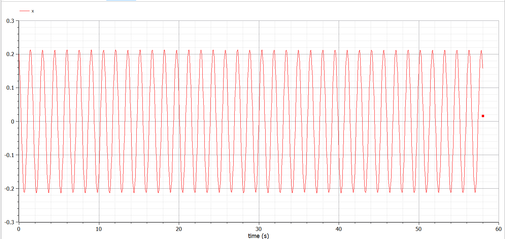
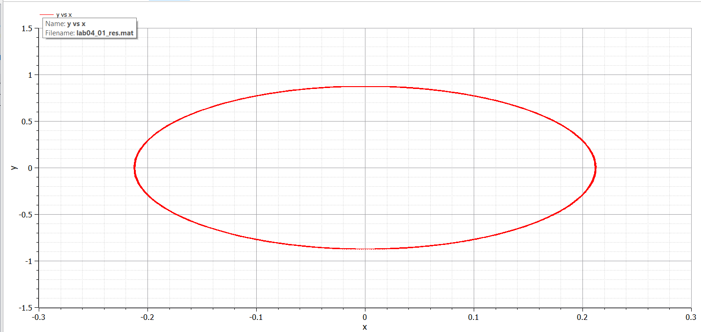
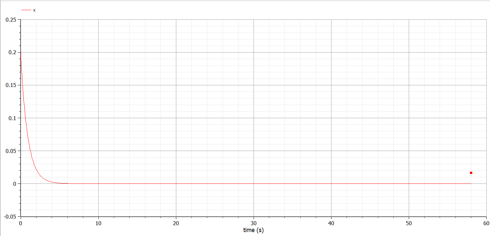
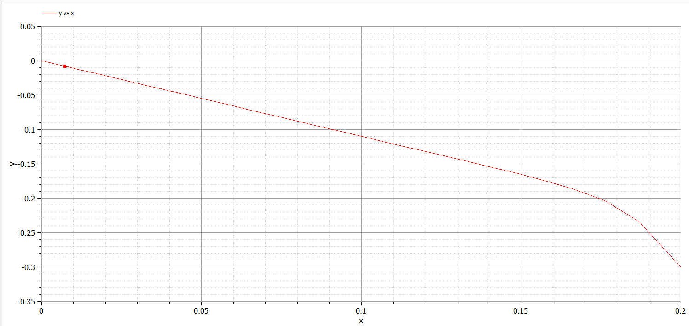
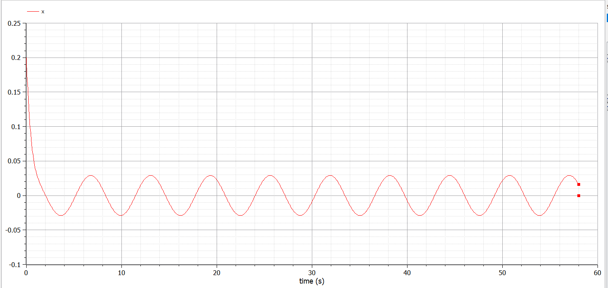
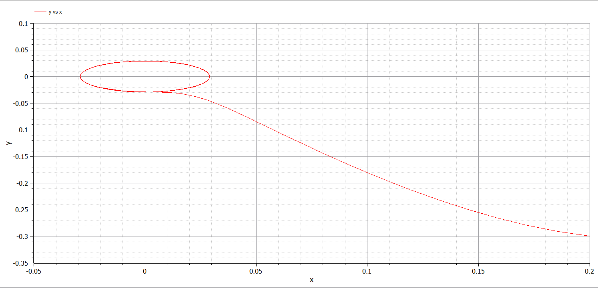

---
## Front matter
lang: ru-RU
title: "Отчет по лабораторной работе 4"
subtitle: "Дисциплина: Математическое моделирование"
author: "Абдуллоев Сайидазизхон Шухратович, НПИбд-02-18"

## Formatting
toc: false
slide_level: 2
theme: metropolis
header-includes:
 - \metroset{progressbar=frametitle,sectionpage=progressbar,numbering=fraction}
 - '\makeatletter'
 - '\beamer@ignorenonframefalse'
 - '\makeatother'
aspectratio: 43
section-titles: true

---

## Прагматика выполнения лабораторной работы

 Данная лабораторная работа выполнялась мной для получения знаний в области математического моделирования и решения уравнений колебаний гармонического осциллятора.

## Цель

Изучить и построить математическую модель гармонических колебаний - линейный гармонический осциллятор.

## Задачи выполнения лабораторной работы

Построить решение уравнения гармонического осциллятора для колебаний гармонического осциллятора без затуханий и без действий внешней силы $\ddot{x}+17x = 0$  (рис. -@fig:001)

{#fig:001 width=70%} 

## Задачи выполнения лабораторной работы

Для этого же случая построить фазовый портрет гармонического осциллятора (рис. -@fig:002)

{#fig:002 width=70%}

## Задачи выполнения лабораторной работы

Построить решение уравнения гармонического осциллятора для колебаний гармонического осциллятора с затуханием и без действий внешней силы $\ddot{x}+22\dot{x}+23x = 0$  (рис. -@fig:003)

{#fig:003 width=70%}

## Задачи выполнения лабораторной работы

Для этого же случая построить фазовый портрет гармонического осциллятора (рис. -@fig:004)

{#fig:004 width=70%}

## Задачи выполнения лабораторной работы

Построить решение уравнения гармонического осциллятора для колебаний гармонического осциллятора с затуханием и под действием внешней силы $\ddot{x}+5\dot{x}+8x = 0.25\sin(8t)$   (рис. -@fig:005)

{#fig:005 width=70%}

## Задачи выполнения лабораторной работы

Для этого же случая построить фазовый портрет гармонического осциллятора (рис. -@fig:006)

{#fig:006 width=70%}

## Результаты выполнения лабораторной работы

Результатом выполнения работы стала построенная математическая модель гармонических колебаний для трех случаев.

## Вывод

Изучил и построил математическую модель гармонических колебаний - линейный гармонический осциллятор.