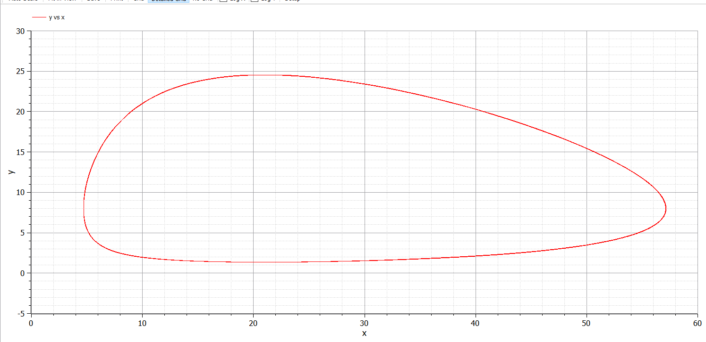
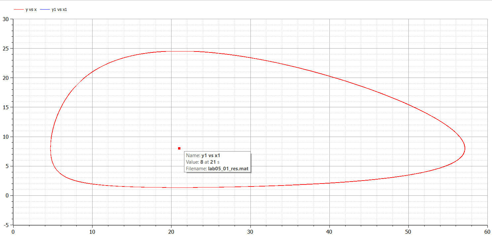

---
## Front matter
lang: ru-RU
title: "Отчет по лабораторной работе 5"
subtitle: "Дисциплина: Математическое моделирование"
author: "Абдуллоев Сайидазизхон Шухратович, НПИбд-02-18"

## Formatting
toc: false
slide_level: 2
theme: metropolis
header-includes:
 - \metroset{progressbar=frametitle,sectionpage=progressbar,numbering=fraction}
 - '\makeatletter'
 - '\beamer@ignorenonframefalse'
 - '\makeatother'
aspectratio: 43
section-titles: true

---

## Прагматика выполнения лабораторной работы

 Данная лабораторная работа выполнялась мной для получения знаний в области математического моделирования и решения уравнений модели хищник-жертва.

## Цель выполнения лабораторной работы

Изучить и построить математическую модель хищник-жертва - модель Лотки-Вольтерры.

## Задачи выполнения лабораторной работы

Для модели хищник-жертва

$$\begin{cases}
    \frac{dx}{dt} = -0.32x(t)+0.04x(t)y(t) \\
    \frac{dy}{dt} = 0.42y(t)-0.02x(t)y(t)
  \end{cases}$$

Построить график зависимости численности хищников от численности жертв при начальных условиях $x_0=9, y_0=20$ на интервале $t\in[0;400]$ и шагом 0.1. (рис. -@fig:001)

## Задачи выполнения лабораторной работы

{#fig:001 width=70%}

## Задачи выполнения лабораторной работы

Построить графики изменения численности хищников и численности жертв для тех же начальных условий (рис. -@fig:002)

{#fig:002 width=70%}

## Задачи выполнения лабораторной работы

Найти стационарное состояние системы (рис. -@fig:003)

{#fig:003 width=70%}

# Вывод

Изучил и построил математическую модель хищник-жертва - модель Лотки-Вольтерры.

