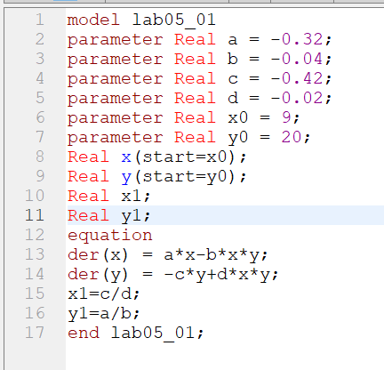

---
# Front matter
lang: ru-RU
title: "Отчет по лабораторной работе №5"
subtitle: "Дисциплина: Математическое моделирование"
author: "Абдуллоев Сайидазизхон Шухратович, НПИбд-02-18"

# Formatting
toc-title: "Содержание"
toc: true # Table of contents
toc_depth: 2
lof: true # List of figures
lot: true # List of tables
fontsize: 12pt
linestretch: 1.5
papersize: a4paper
documentclass: scrreprt
polyglossia-lang: russian
polyglossia-otherlangs: english
mainfont: PT Serif
romanfont: PT Serif
sansfont: PT Sans
monofont: PT Mono
mainfontoptions: Ligatures=TeX
romanfontoptions: Ligatures=TeX
sansfontoptions: Ligatures=TeX,Scale=MatchLowercase
monofontoptions: Scale=MatchLowercase
indent: true
pdf-engine: lualatex
header-includes:
  - \linepenalty=10 # the penalty added to the badness of each line within a paragraph (no associated penalty node) Increasing the value makes tex try to have fewer lines in the paragraph.
  - \interlinepenalty=0 # value of the penalty (node) added after each line of a paragraph.
  - \hyphenpenalty=50 # the penalty for line breaking at an automatically inserted hyphen
  - \exhyphenpenalty=50 # the penalty for line breaking at an explicit hyphen
  - \binoppenalty=700 # the penalty for breaking a line at a binary operator
  - \relpenalty=500 # the penalty for breaking a line at a relation
  - \clubpenalty=150 # extra penalty for breaking after first line of a paragraph
  - \widowpenalty=150 # extra penalty for breaking before last line of a paragraph
  - \displaywidowpenalty=50 # extra penalty for breaking before last line before a display math
  - \brokenpenalty=100 # extra penalty for page breaking after a hyphenated line
  - \predisplaypenalty=10000 # penalty for breaking before a display
  - \postdisplaypenalty=0 # penalty for breaking after a display
  - \floatingpenalty = 20000 # penalty for splitting an insertion (can only be split footnote in standard LaTeX)
  - \raggedbottom # or \flushbottom
  - \usepackage{float} # keep figures where there are in the text
  - \floatplacement{figure}{H} # keep figures where there are in the text
---
# Цель работы

Изучить и построить математическую модель хищник-жертва - модель Лотки-Вольтерры.

# Задание

Для модели хищник-жертва

$$\begin{cases}
    \frac{dx}{dt} = -0.32x(t)+0.04x(t)y(t) \\
    \frac{dy}{dt} = 0.42y(t)-0.02x(t)y(t)
  \end{cases}$$

Построить график зависимости численности хищников от численности жертв, а также графики изменения численности хищников и численности жертв при следующих начальных условиях: $x_0=9, y_0=20$ . Найти стационарное состояние системы.

# Объект и предмет исследования

Объектом исследования в данной лабораторной работе является модель хищник-жертва, а предметом исследования - графики зависимости численности популяций, графики изменения численности популяций для конкретного случая.

# Теоретические вводные данные

Простейшая модель взаимодействия двух видов типа «хищник — жертва» - модель Лотки-Вольтерры. Данная двувидовая модель основывается на следующих предположениях:

1. Численность популяции жертв x и хищников y зависят только от времени (модель не учитывает пространственное распределение популяции на занимаемой территории)  
2. В отсутствии взаимодействия численность видов изменяется по модели Мальтуса, при этом число жертв увеличивается, а число хищников падает  
3. Естественная смертность жертвы и естественная рождаемость хищника считаются несущественными  
4. Эффект насыщения численности обеих популяций не учитывается  
5. Скорость роста численности жертв уменьшается пропорционально численности хищников  

$$\frac{dx}{dt} = ax(t)-bx(t)y(t)$$
$$\frac{dy}{dt} = -cy(t)+dx(t)y(t)$$

В этой модели $x$ – число жертв, $y$ - число хищников. Коэффициент $a$ описывает скорость естественного прироста числа жертв в отсутствие хищников, $c$ - естественное вымирание хищников, лишенных пищи в виде жертв. Вероятность взаимодействия жертвы и хищника считается пропорциональной как количеству жертв, так и числу самих хищников ($xy$). Каждый акт взаимодействия уменьшает популяцию жертв, но способствует увеличению популяции хищников (члены $-bxy$ и $dxy$ в правой части уравнения).

Математический анализ этой модели показывает, что имеется стационарное состояние, всякое же другое начальное состояние приводит к периодическому колебанию численности как жертв, так и хищников, так что по прошествии некоторого времени система возвращается в начальное состояние. Стационарное состояние системы (положение равновесия, не зависящее от времени решение) будет в точке: $x_0=\frac{c}{d}, y_0=\frac{a}{b}$. Если начальные значения задать в стационарном состоянии $x(0)=x_0, y(0)=y_0$, то в любой момент времени численность популяций изменяться не будет. При малом отклонении от положения равновесия численности как хищника, так и жертвы с течением времени не возвращаются к равновесным значениям, а совершают периодические колебания вокруг стационарной точки. Амплитуда колебаний и их период определяется начальными значениями численностей $x(0), y(0)$. Колебания совершаются в противофазе.

# Выполнение лабораторной работы

## Шаг 1

Я построил модель с данными начальными условиями в Modelica. Увидеть его можно на (рис. -@fig:001)

{#fig:001 width=70%}

## Шаг 2

Построил график зависимости численности хищников от численности жертв для этого случая на интервале $t\in[0;400]$ и шагом 0.1. График изображен на следующем рисунке (рис. -@fig:002)

{#fig:002 width=70%}

## Шаг 3

Построил графики изменения численности хищников и численности жертв, которые изображены на (рис. -@fig:003)

{#fig:003 width=70%}

## Шаг 4

Нашла стационарное состояние системы. Стационарная точка имеет координаты $(x1,y1)$, значение которых не совпадает с начальными условиями, потому численность жертв и хищников колеблется вокруг этой точки, что можно увидеть на (рис. -@fig:004)

{#fig:004 width=85%}

# Вывод

Изучил и построил математическую модель хищник-жертва - модель Лотки-Вольтерры.