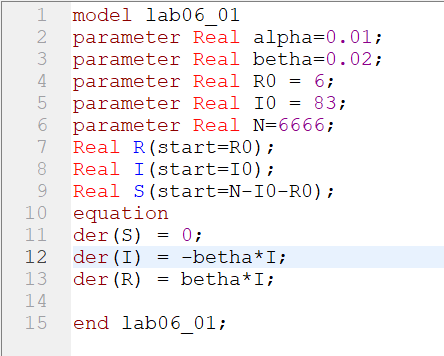
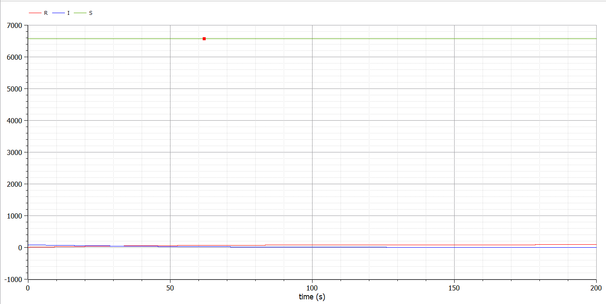
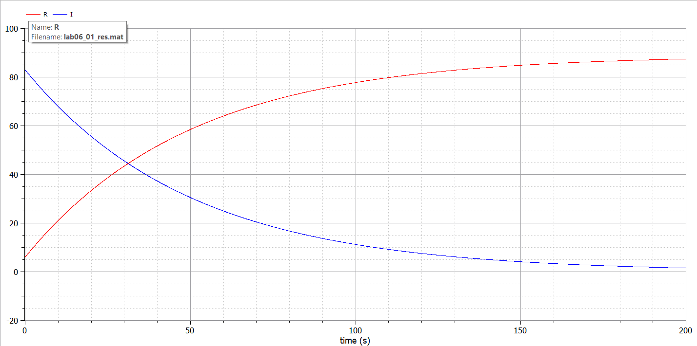
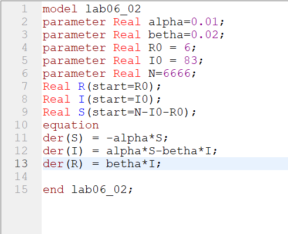
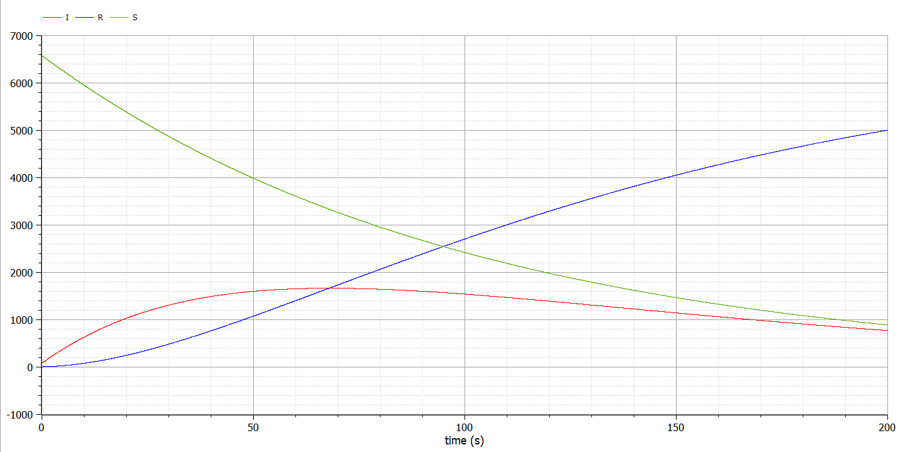

---
# Front matter
lang: ru-RU
title: "Отчет по лабораторной работе №6"
subtitle: "Дисциплина: Математическое моделирование"
author: "Абдуллоев Сайидазизхон Шухратович, НПИбд-02-18"

# Formatting
toc-title: "Содержание"
toc: true # Table of contents
toc_depth: 2
lof: true # List of figures
lot: true # List of tables
fontsize: 12pt
linestretch: 1.5
papersize: a4paper
documentclass: scrreprt
polyglossia-lang: russian
polyglossia-otherlangs: english
mainfont: PT Serif
romanfont: PT Serif
sansfont: PT Sans
monofont: PT Mono
mainfontoptions: Ligatures=TeX
romanfontoptions: Ligatures=TeX
sansfontoptions: Ligatures=TeX,Scale=MatchLowercase
monofontoptions: Scale=MatchLowercase
indent: true
pdf-engine: lualatex
header-includes:
  - \linepenalty=10 # the penalty added to the badness of each line within a paragraph (no associated penalty node) Increasing the value makes tex try to have fewer lines in the paragraph.
  - \interlinepenalty=0 # value of the penalty (node) added after each line of a paragraph.
  - \hyphenpenalty=50 # the penalty for line breaking at an automatically inserted hyphen
  - \exhyphenpenalty=50 # the penalty for line breaking at an explicit hyphen
  - \binoppenalty=700 # the penalty for breaking a line at a binary operator
  - \relpenalty=500 # the penalty for breaking a line at a relation
  - \clubpenalty=150 # extra penalty for breaking after first line of a paragraph
  - \widowpenalty=150 # extra penalty for breaking before last line of a paragraph
  - \displaywidowpenalty=50 # extra penalty for breaking before last line before a display math
  - \brokenpenalty=100 # extra penalty for page breaking after a hyphenated line
  - \predisplaypenalty=10000 # penalty for breaking before a display
  - \postdisplaypenalty=0 # penalty for breaking after a display
  - \floatingpenalty = 20000 # penalty for splitting an insertion (can only be split footnote in standard LaTeX)
  - \raggedbottom # or \flushbottom
  - \usepackage{float} # keep figures where there are in the text
  - \floatplacement{figure}{H} # keep figures where there are in the text
---
# Цель работы

Изучить и построить простейшую модель эпидемии.

# Задание

На одном острове вспыхнула эпидемия. Известно, что из всех проживающих на острове ($N=6666$) в момент начала эпидемии ($t=0$) число заболевших людей (являющихся распространителями инфекции) $I(0)=83$, а число здоровых людей с иммунитетом к болезни $R(0)=6$. Таким образом, число людей восприимчивых к болезни, но пока здоровых, в начальный момент времени $S(0)=N-I(0)- R(0)$. Построить графики изменения числа особей в каждой из трех групп. Рассмотреть, как будет протекать эпидемия в случае:

  1. если  $I(0) \leq I^*$  
  2. если $I(0) > I^*$  

# Объект и предмет исследования

Объектом исследования в данной лабораторной работе является модель эпидемии, а предметом исследования - графики изменения числа болеющих, здоровых и людей с иммунитетом.

# Теоретические вводные данные

Предположим, что некая популяция, состоящая из N особей, (считаем, что популяция изолирована) подразделяется на три группы. Первая группа - это восприимчивые к болезни, но пока здоровые особи, обозначим их через $S(t)$. Вторая группа – это число инфицированных особей, которые также при этом являются распространителями инфекции, обозначим их $I(t)$. А третья группа, обозначающаяся через $R(t)$ – это здоровые особи с иммунитетом к болезни.
До того, как число заболевших не превышает критического значения $I^*$, считаем, что все больные изолированы и не заражают здоровых. Когда $I(t)$, тогда инфицированные способны заражать восприимчивых к болезни особей.
Таким образом, скорость изменения числа $S(t)$ меняется по следующему закону:

$$\frac{dS}{dt}=
\begin{cases}
-\alpha S, & \text {если } I(t)>I^*\\
0, &\text {если } I(t)\leq I^*
\end{cases}
$$
Поскольку каждая восприимчивая к болезни особь, которая, в конце концов, заболевает, сама становится инфекционной, то скорость изменения числа инфекционных особей представляет разность за единицу времени между заразившимися и теми, кто уже болеет и лечится, т.е.:

$$\frac{dI}{dt}=
\begin{cases}
-\alpha S - \beta I , & \text {если } I(t)>I^*\\
-\beta I, &\text {если } I(t)\leq I^*
\end{cases}
$$

А скорость изменения выздоравливающих особей (при этом приобретающие иммунитет к болезни)

$$\frac{dR}{dt}=\beta I$$

Постоянные пропорциональности $\alpha, \beta$ - это коэффициенты заболеваемости и выздоровления соответственно.
Для того, чтобы решения соответствующих уравнений определялось однозначно, необходимо задать начальные условия. Считаем, что на начало эпидемии в момент времени $t=0$ нет особей с иммунитетом к болезни $R(0)=0$, а число инфицированных и восприимчивых к болезни особей $I(0)$ и $S(0)$  соответственно. Для анализа картины протекания эпидемии необходимо рассмотреть два случая: $I(0) \leq I^* и I(0) > I^*$

# Выполнение лабораторной работы

## Шаг 1

Я построил модель для первого случая, когда все больные изолированы и не заражают здоровых, с данными начальными условиями в Modelica. Увидеть это можно на Рисунке 1 (рис. -@fig:001). Коэффициент $\alpha$ = 0.01, $\beta = 0.02$

{#fig:001 width=70%}

## Шаг 2

Построил динамику изменения числа людей в каждой из трех групп на интервале $t\in[0;200]$ и шагом 0.01. График изображен на следующем рисунке (рис. -@fig:002)

{#fig:002 width=70%}

## Шаг 3

Число болеющих в первое время эпидемии снижается быстрее, чем в дальнейшем. Соответственно, в начале эпидемии число людей с иммунитетом растет быстро (рис. -@fig:003)  

{#fig:003 width=70%}

## Шаг 4

Построил модель для второго случая, когда инфицированные способны заражать восприимчивых к болезни особей, с данными начальными условиями, которая изображена на Рисунке 4  (рис. -@fig:004)

{#fig:004 width=70%}

## Шаг 5

Построил динамику изменения числа людей в каждой из трех групп на интервале $t\in[0;200]$ и шагом 0.01. График изображен на следующем рисунке (рис. -@fig:005)  
При данной ситуации число здоровых людей непостоянно и снижается. В то же время растет число людей с иммунитетом. Также видно, что пик количества заболевших приходится на начало второй четверти эпидемии, после чего число инфицированных начинает снижаться.

{#fig:005 width=85%}

# Вывод

Изучить и построить простейшую модель эпидемии.