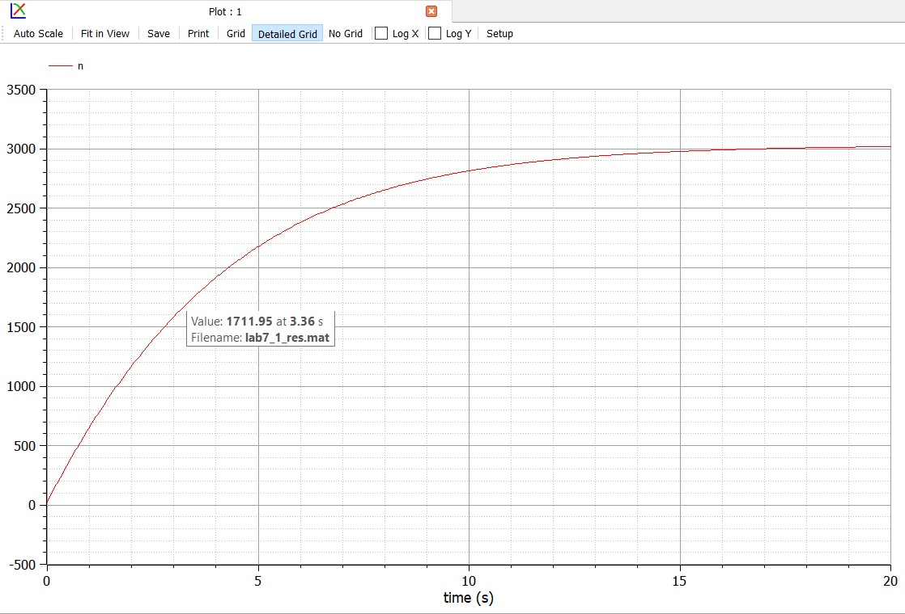
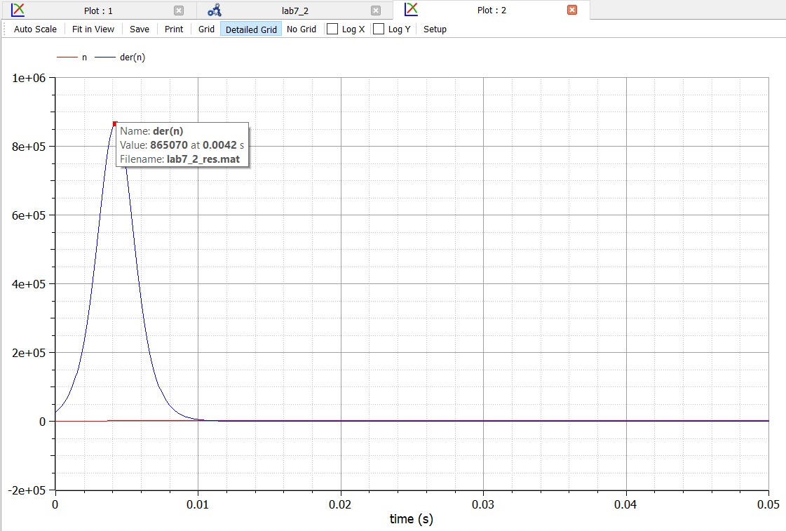
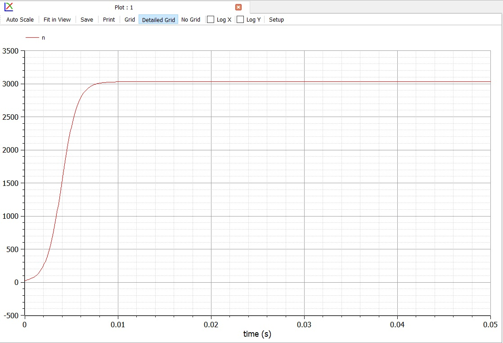

---
## Front matter
lang: ru-RU
title: Защита лабораторной работы № 7
author: Абдуллоев Сайидазизхон Шухратович
institute: RUDN University, Moscow, Russian Federation

## Formatting
toc: false
slide_level: 2
theme: metropolis
header-includes: 
 - \metroset{progressbar=frametitle,sectionpage=progressbar,numbering=fraction}
 - '\makeatletter'
 - '\beamer@ignorenonframefalse'
 - '\makeatother'
aspectratio: 43
section-titles: true
---

# Цель работы

## Цель работы

$\quad$Научиться моделировать модель рекламной кампании. 

# Формулировка задачи.

## Формулировка задачи

$\quad$Постройте график распространения рекламы, математическая модель которой описывается
следующим уравнением:

$$1. \ \frac{\partial{n}}{dt} \ = \ (0.288 + 0.000018n(t))(N - n(t))$$

$$2. \ \frac{\partial{n}}{dt} \ = \ (0.000018 +  0.377n(t))(N - n(t))$$

$$3. \ \frac{\partial{n}}{dt} \ = \ (0.1t + 0.4\cos{t}n(t))(N - n(t))$$

При этом объем аудитории N = 3030, в начальный момент о товаре знает 24 человек. Для случая 2 определите в какой момент времени скорость распространения рекламы будет иметь максимальное значение

# Решение задачи

## Решение задачи 1

{ #fig:001 width=70% }

## Решение задачи 2

{ #fig:002 width=70% }

## Максимальная скорость распространения рекламы

Построив график для 2-ой модели $\frac{dn}{dt}$, смог определить, в какой момент времени (0,0042 s) скорость распространения рекламы имеет максимальное значение  (рис. -@fig:003).

{#fig:003 width=70% }

## Решение задачи 3

{ #fig:004 width=70% }

# Вывод 

$\quad$В ходе лабораторной работы мы научились моделировать модель рекламной кампании.