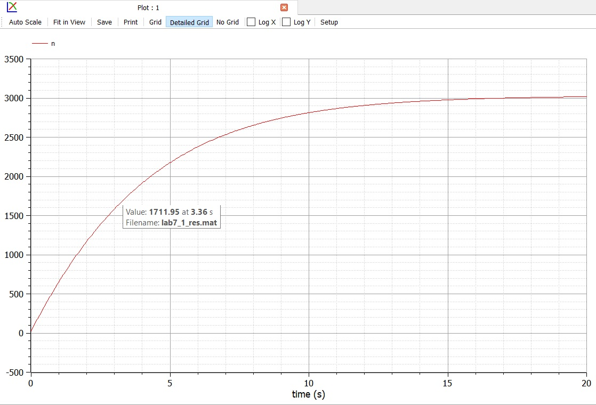

---
# Front matter
lang: ru-RU
title: "Отчет по лабораторной работе № 7."
subtitle: "дисциплина: Математическое моделирование"
author: "Абдуллоев Сайидазизхон Шухратович"

# Formatting
toc-title: "Содержание"
toc: true # Table of contents
toc_depth: 2
lof: false # List of figures
lot: false # List of tables
fontsize: 12pt
linestretch: 1.5
papersize: a4paper
documentclass: scrreprt
polyglossia-lang: russian
polyglossia-otherlangs: english
mainfont: PT Serif
romanfont: PT Serif
sansfont: PT Sans
monofont: PT Mono
mainfontoptions: Ligatures=TeX
romanfontoptions: Ligatures=TeX
sansfontoptions: Ligatures=TeX,Scale=MatchLowercase
monofontoptions: Scale=MatchLowercase
indent: true
pdf-engine: lualatex
header-includes:
  - \linepenalty=10 # the penalty added to the badness of each line within a paragraph (no associated penalty node) Increasing the value makes tex try to have fewer lines in the paragraph.
  - \interlinepenalty=0 # value of the penalty (node) added after each line of a paragraph.
  - \hyphenpenalty=50 # the penalty for line breaking at an automatically inserted hyphen
  - \exhyphenpenalty=50 # the penalty for line breaking at an explicit hyphen
  - \binoppenalty=700 # the penalty for breaking a line at a binary operator
  - \relpenalty=500 # the penalty for breaking a line at a relation
  - \clubpenalty=150 # extra penalty for breaking after first line of a paragraph
  - \widowpenalty=150 # extra penalty for breaking before last line of a paragraph
  - \displaywidowpenalty=50 # extra penalty for breaking before last line before a display math
  - \brokenpenalty=100 # extra penalty for page breaking after a hyphenated line
  - \predisplaypenalty=10000 # penalty for breaking before a display
  - \postdisplaypenalty=0 # penalty for breaking after a display
  - \floatingpenalty = 20000 # penalty for splitting an insertion (can only be split footnote in standard LaTeX)
  - \raggedbottom # or \flushbottom
  - \usepackage{float} # keep figures where there are in the text
  - \floatplacement{figure}{H} # keep figures where there are in the text
---

# Цель работы

$\quad$Научиться моделировать модель рекламной кампании. 

# Выполнение лабораторной работы

## Краткая теоретическая справка

$\quad$Предположим, что торговыми учреждениями реализуется некоторая
продукция, о которой в момент времени $t$ из числа потенциальных покупателей N
знает лишь $n$ покупателей. Для ускорения сбыта продукции запускается реклама
по радио, телевидению и других средств массовой информации. После запуска
рекламной кампании информация о продукции начнет распространяться среди
потенциальных покупателей путем общения друг с другом. Таким образом, после
запуска рекламных объявлений скорость изменения числа знающих о продукции
людей пропорциональна как числу знающих о товаре покупателей, так и числу
покупателей о нем не знающих

Модель рекламной кампании описывается следующими величинами. Считаем, $\frac{\partial{n}}{dt}$ - скорость изменения со временем числа потребителей, узнавших о товаре и готовых его купить, $t$ - время, прошедшее с начала рекламной кампании, $n(t)$ - число уже информированных клиентов. Эта величина пропорциональна числу покупателей, еще не знающих о нем, это описывается следующим образом: $\alpha_1(t)(N-n(t))$, где $N$ - общее число потенциальных платежеспособных покупателей, $\alpha_1(t)>0$ - характеризует интенсивность
рекламной кампании (зависит от затрат на рекламу в данный момент времени).
Помимо этого, узнавшие о товаре потребители также распространяют полученную
информацию среди потенциальных покупателей, не знающих о нем (в этом случае
работает т.н. сарафанное радио). Этот вклад в рекламу описывается величиной $\alpha_2(t)n(t)(N-n(t))$,  эта величина увеличивается с увеличением потребителей
узнавших о товаре. Математическая модель распространения рекламы описывается
уравнением:

$$\frac{\partial{n}}{dt} \ = \ (\alpha_1(t) + \alpha_2(t)n(t))(N - n(t)).$$


## Формулировка задачи.

$\quad$Постройте график распространения рекламы, математическая модель которой описывается
следующим уравнением:

$$1. \ \frac{\partial{n}}{dt} \ = \ (0.288 + 0.000018n(t))(N - n(t))$$

$$2. \ \frac{\partial{n}}{dt} \ = \ (0.000018 +  0.377n(t))(N - n(t))$$

$$3. \ \frac{\partial{n}}{dt} \ = \ (0.1t + 0.4\cos{t}n(t))(N - n(t))$$

При этом объем аудитории N = 3030, в начальный момент о товаре знает 24 человек. Для случая 2 определите в какой момент времени скорость распространения рекламы будет иметь максимальное значение

## Решение задачи

$\quad$Парарметры для задач нам даны в варианте ($x_0 = 24, N = 3030$).

1. Напишем программный код для решения задачи 1 и построим график (рис. -@fig:001).

  ```Modelica
 model lab7_1
parameter Real a1 = 0.228;
parameter Real a2 = 0.000018;
parameter Real N = 3030;
parameter Real n0 = 24;

Real n(start=n0);
equation
der(n) = (a1+a2*n) * (N-n);
end lab7_1;
  ```

  { #fig:001 width=70% }

2. Напишем программный код для решения задачи 2 и построим график (рис. -@fig:002).

  ```Modelica
model lab7_2
parameter Real a1 = 0.000018;
parameter Real a2 = 0.377;
parameter Real N = 3030;
parameter Real n0 = 24;

Real n(start=n0);
equation
der(n) = (a1+a2*n) * (N-n);
end lab7_2;
  ```

   { #fig:002 width=70% }

Построив график $\frac{dn}{dt}$, смог определить, в какой момент времени (0,0042 s) скорость распространения рекламы имеет максимальное значение  (рис. -@fig:003).

{#fig:003 width=70% }

3. Напишем программный код для решения задачи 3 и построим график (рис. -@fig:004).

  ```Modelica
model lab7_3
parameter Real a1 = 0.1;
parameter Real a2 = 0.4;
parameter Real N = 3030;
parameter Real n0 = 24;

Real n(start=n0);
equation
der(n) = (a1*(time)+a2*Modelica.Math.cos(time)*n) * (N-n);
end lab7_3;
  ```

  { #fig:004 width=70% }


# Вывод

$\quad$В ходе лабораторной работы я научился моделировать модель рекламной кампании.