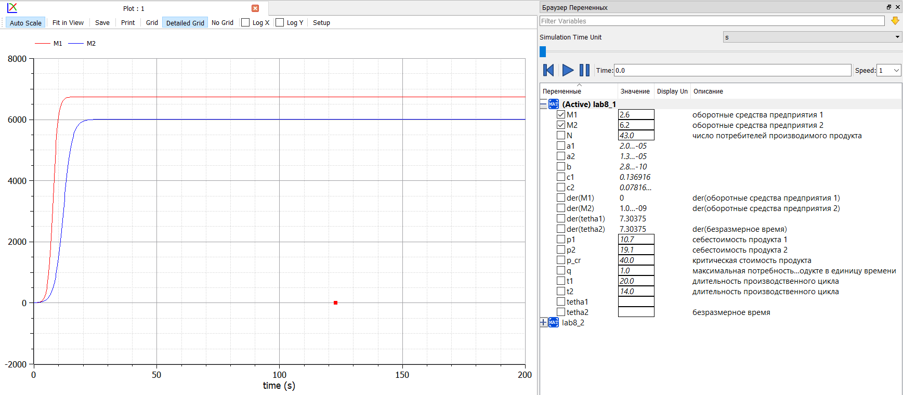
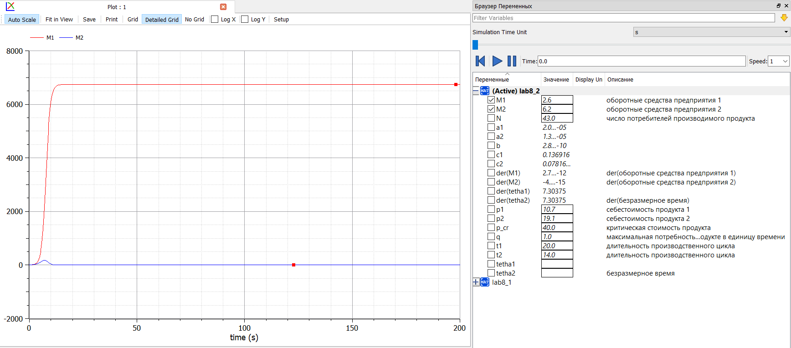

---
## Front matter
lang: ru-RU
title: Защита лабораторной работы № 8. Модель конкуренции двух фирм
author: Абдуллоев Сайидазизхон Шухратович
institute: RUDN University, Moscow, Russian Federation

## Formatting
toc: false
slide_level: 2
theme: metropolis
header-includes: 
 - \metroset{progressbar=frametitle,sectionpage=progressbar,numbering=fraction}
 - '\makeatletter'
 - '\beamer@ignorenonframefalse'
 - '\makeatother'
aspectratio: 43
section-titles: true
---

# Цель работы

## Цель работы

$\quad$Научиться моделировать модель конкуренции двух фирм. 

# Формулировка задачи. 

## Формулировка задачи

**Случай 1.** 

$$
  \begin{cases} 
  \ \frac{\partial{M_1}}{\partial{\theta}} \ = \ M_1 - \frac{b}{c_1}M_1*M_2 - \frac{a_1}{c_1}*M_1^2 \\
  \ \frac{\partial{M_2}}{\partial{\theta}} \ = \ \frac{c_2}{c_1}M_2 - \frac{b}{c_1}M_1*M_2 - \frac{a_2}{c_1}*M_2^2 \\
  \end{cases}
$$

$$a_1 = \frac{p_{cr}}{\tau_1^2 p_1^2Nq}, \ a_2 = \frac{p_{cr}}{\tau_2^2 p_2^2Nq}, \ b = \frac{p_{cr}}{\tau_1^2p_1^2\tau_2^2p^2_2Nq}$$
$$c_1 = \frac{p_{cr}-p_1}{\tau_1p_1}, c_2 = \frac{p_{cr}-p_2}{\tau_2p_2} $$

## Формулировка задачи

**Случай 2.** 

$$
  \begin{cases} 
  \ \frac{\partial{M_1}}{\partial{\theta}} \ = \ M_1 - \frac{b}{c_1}M_1*M_2 - \frac{a_1}{c_1}*M_1^2 \\
  \ \frac{\partial{M_2}}{\partial{\theta}} \ = \ \frac{c_2}{c_1}M_2 - (\frac{b}{c_1} + 0.00026)M_1*M_2 - \frac{a_2}{c_1}*M_2^2 \\
  \end{cases}
$$

$$a_1 = \frac{p_{cr}}{\tau_1^2 p_1^2Nq}, \ a_2 = \frac{p_{cr}}{\tau_2^2 p_2^2Nq}, \ b = \frac{p_{cr}}{\tau_1^2p_1^2\tau_2^2p^2_2Nq}$$
$$c_1 = \frac{p_{cr}-p_1}{\tau_1p_1}, c_2 = \frac{p_{cr}-p_2}{\tau_2p_2} $$

## Формулировка задачи

Соответствующие коэффициенты для обоих случаев: 

$$M^1_0 = 2.6, M_0^2 = 6.2$$
$$p_{cr}=40, N=43, q=1$$
$$\tau_1 = 20, \tau_2 = 14$$
$$p_1 = 10.7, p_2 = 19.1$$

## Формулировка задачи

$N$ - число потребителей производимого продукта.

$\tau$ - длительность производственного цикла.

$p_{cr}$ -  рыночная цена товара.

$p$ - себестоимость продукта, то есть переменные издержки на производство единицы продукции.

$q$ - максимальная потребность одного человека в продукте в единицу времени.

$\theta = \frac{t}{c_1}$ - безразмерное время.

# Решение задачи

## Решение задачи 1

{ #fig:001 width=70% }

## Решение задачи 2

{ #fig:002 width=70% }

# Вывод 

$\quad$В ходе лабораторной работы мы научились моделировать модель конкуренции двух фирм. 