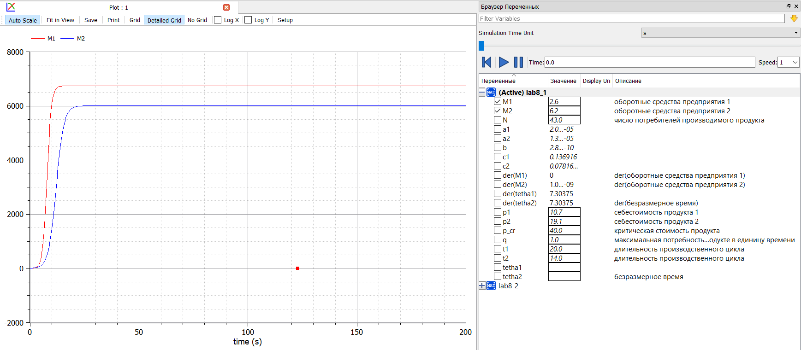

---
# Front matter
lang: ru-RU
title: "Отчет по лабораторной работе № 8."
subtitle: "Дисциплина: Математическое моделирование"
author: "Абдуллоев Сайидазизхон Шухратович. Группа: НПИ-02-18"

# Formatting
toc-title: "Содержание"
toc: true # Table of contents
toc_depth: 2
lof: false # List of figures
lot: false # List of tables
fontsize: 12pt
linestretch: 1.5
papersize: a4paper
documentclass: scrreprt
polyglossia-lang: russian
polyglossia-otherlangs: english
mainfont: PT Serif
romanfont: PT Serif
sansfont: PT Sans
monofont: PT Mono
mainfontoptions: Ligatures=TeX
romanfontoptions: Ligatures=TeX
sansfontoptions: Ligatures=TeX,Scale=MatchLowercase
monofontoptions: Scale=MatchLowercase
indent: true
pdf-engine: lualatex
header-includes:
  - \linepenalty=10 # the penalty added to the badness of each line within a paragraph (no associated penalty node) Increasing the value makes tex try to have fewer lines in the paragraph.
  - \interlinepenalty=0 # value of the penalty (node) added after each line of a paragraph.
  - \hyphenpenalty=50 # the penalty for line breaking at an automatically inserted hyphen
  - \exhyphenpenalty=50 # the penalty for line breaking at an explicit hyphen
  - \binoppenalty=700 # the penalty for breaking a line at a binary operator
  - \relpenalty=500 # the penalty for breaking a line at a relation
  - \clubpenalty=150 # extra penalty for breaking after first line of a paragraph
  - \widowpenalty=150 # extra penalty for breaking before last line of a paragraph
  - \displaywidowpenalty=50 # extra penalty for breaking before last line before a display math
  - \brokenpenalty=100 # extra penalty for page breaking after a hyphenated line
  - \predisplaypenalty=10000 # penalty for breaking before a display
  - \postdisplaypenalty=0 # penalty for breaking after a display
  - \floatingpenalty = 20000 # penalty for splitting an insertion (can only be split footnote in standard LaTeX)
  - \raggedbottom # or \flushbottom
  - \usepackage{float} # keep figures where there are in the text
  - \floatplacement{figure}{H} # keep figures where there are in the text
---

# Цель работы

$\quad$Научиться моделировать модель конкуренции двух фирм. 

## Задание

**Вариант 45**

**Случай 1.**  Рассмотрим две фирмы, производящие взаимозаменяемые товары одинакового качества и находящиеся в одной рыночной нише. Считаем, что в рамках
нашей модели конкурентная борьба ведётся только рыночными методами. То есть, конкуренты могут влиять на противника путем изменения параметров своего
производства: себестоимость, время цикла, но не могут прямо вмешиваться в ситуацию на рынке («назначать» цену или влиять на потребителей каким-либо иным
способом). Будем считать, что постоянные издержки пренебрежимо малы, и в модели учитывать не будем. В этом случае динамика изменения объемов продаж фирмы 1 
и фирмы 2 описывается следующей системой уравнений:
$$
  \begin{cases} 
  \ \frac{\partial{M_1}}{\partial{\theta}} \ = \ M_1 - \frac{b}{c_1}M_1*M_2 - \frac{a_1}{c_1}*M_1^2 \\
  \ \frac{\partial{M_2}}{\partial{\theta}} \ = \ \frac{c_2}{c_1}M_2 - \frac{b}{c_1}M_1*M_2 - \frac{a_2}{c_1}*M_2^2 \\
  \end{cases}
$$

$$a_1 = \frac{p_{cr}}{\tau_1^2 p_1^2Nq}, \ a_2 = \frac{p_{cr}}{\tau_2^2 p_2^2Nq}, \ b = \frac{p_{cr}}{\tau_1^2p_1^2\tau_2^2p^2_2Nq} \ c_1 = \frac{p_{cr}-p_1}{\tau_1p_1}, c_2 = \frac{p_{cr}-p_2}{\tau_2p_2} $$

Также введена нормировка $t = c_1 \theta$.

**Случай 2.**  Рассмотрим модель, когда, помимо экономического фактора влияния (изменение себестоимости, производственного цикла, использование кредита и т.п.), 
используются еще и социально-психологические факторы -- формирование общественного предпочтения одного товара другому, не зависимо от их качества и цены. В 
этом случае взаимодействие двух фирм будет зависеть друг от друга, соответственно коэффициент перед $M_1 M_2$ будет отличаться. Пусть в рамках 
рассматриваемой модели динамика изменения объемов продаж фирмы 1 и фирмы 2 описывается следующей системой уравнений:

$$
\begin{cases} 
  \ \frac{\partial{M_1}}{\partial{\theta}} \ = \ M_1 - \frac{b}{c_1}M_1*M_2 - \frac{a_1}{c_1}*M_1^2 \\
  \ \frac{\partial{M_2}}{\partial{\theta}} \ = \ \frac{c_2}{c_1}M_2 - (\frac{b}{c_1} + 0.00026)M_1*M_2 - \frac{a_2}{c_1}*M_2^2 \\
  \end{cases}
$$

$$a_1 = \frac{p_{cr}}{\tau_1^2 p_1^2Nq}, \ a_2 = \frac{p_{cr}}{\tau_2^2 p_2^2Nq}, \ b = \frac{p_{cr}}{\tau_1^2p_1^2\tau_2^2p^2_2Nq} \ c_1 = \frac{p_{cr}-p_1}{\tau_1p_1}, c_2 = \frac{p_{cr}-p_2}{\tau_2p_2} $$


Соответствующие коэффициенты для обоих случаев: 

$$M^1_0 = 2.6, M_0^2 = 6.2$$
$$p_{cr}=40, N=43, q=1$$
$$\tau_1 = 20, \tau_2 = 14$$
$$p_1 = 10.7, p_2 = 19.1$$

**Замечание:** Значения $p_{cr}, \tilde{p}_{1,2}, N$ указаны в тысячах единиц, а значения $M_{1,2}$ указаны в млн единиц.

**Обозначения:**

$N$ -- число потребителей производимого продукта;

$\tau$ -- длительность производственного цикла;

$p$ -- рыночная цена товара;

$\tilde{p}$ -- себестоимость продукта, то есть переменные издержки на производство единицы продукции;

$q$ -- максимальная потребность одного человека в продукте в единицу времени;

$\theta = \frac{t}{c_1}$ -- безразмерное время.

1. Постройте графики изменения оборотных средств фирмы 1 и фирмы 2 без учета постоянных издержек и с веденной нормировкой для случая 1.
2. Постройте графики изменения оборотных средств фирмы 1 и фирмы 2 без учета постоянных издержек и с веденной нормировкой для случая 2.
3. Найдите стационарное состояние системы для первого случая.

# Теоретическое введение

Вначале рассмотрим модель фирмы, производящей продукт долговременного пользования, когда цена его определяется балансом спроса и предложения. Примем, что этот продукт занимает определенную нишу рынка и конкуренты в ней отсутствуют. Обозначим:
$N$ – число потребителей производимого продукта.
$S$ – доходы потребителей данного продукта. Считаем, что доходы всех потребителей одинаковы. Это предположение справедливо, если речь идет об одной рыночной нише, т.е. производимый продукт ориентирован на определенный слой населения.
$M$ – оборотные средства предприятия
$\tau$ – длительность производственного цикла
$p$ – рыночная цена товара
$\tilde{p}$ – себестоимость продукта, то есть переменные издержки на производство единицы продукции.
$\delta$ – доля оборотных средств, идущая на покрытие переменных издержек.
$\kappa$ – постоянные издержки, которые не зависят от количества выпускаемой продукции.

$Q(S/p)$ – функция спроса, зависящая от отношения дохода $S$ к цене $p$. Она равна количеству продукта, потребляемого одним потребителем в единицу времени. Функцию спроса товаров долговременного использования часто представляют в простейшей форме:

\begin{equation} Q=q-k\frac{p}{S}=q(1-\frac{p}{p_{cr}}) \end{equation}

где $q$ – максимальная потребность одного человека в продукте в единицу времени. Эта функция падает с ростом цены и при $p=p_{cr}$ (критическая стоимость продукта) потребители отказываются от приобретения товара. Величина $p_cr = Sq/k$. Параметр $k$ – мера эластичности функции спроса по цене. Таким образом, функция спроса в форме (1) является пороговой (то есть, $Q(S/p) = 0$ при $p \geq p_{cr}$) и обладает свойствами насыщения.

Уравнения динамики оборотных средств средств можно записать в виде

\begin{equation} \frac{dM}{dt}=-\frac{M\delta}{\tau}+NQp-\kappa=-\frac{M\delta}{\tau}+Nq(1-\frac{p}{p_{cr}})p-\kappa \end{equation}

Уравнение для рыночной цены $p$ представим в виде

\begin{equation} \frac{dp}{dt}=\gamma(-\frac{M\delta}{\tau\tilde{p}}+Nq(1-\frac{p}{p_{cr}})) \end{equation}

Первый член соответствует количеству поставляемого на рынок товара (то есть, предложению), а второй член – спросу. Параметр $\gamma$ зависит от скорости оборота товаров на рынке. Как правило, время торгового оборота существенно меньше времени производственного цикла $\tau$. При заданном $M$ уравнение (3) описывает быстрое стремление цены к равновесному значению цены, которое устойчиво. В этом случае уравнение (3) можно заменить алгебраическим соотношением

\begin{equation} -\frac{M\delta}{\tau\tilde{p}}+Nq(1-\frac{p}{p_{cr}})=0 \end{equation}

Из (4) следует, что равновесное значение цены $p$ равно

\begin{equation} p=p_{cr}(1-\frac{M\delta}{\tau\tilde{p}Nq}) \end{equation}

Уравнение (2) с учетом (5) приобретает вид

\begin{equation} \frac{dM}{dt}=M\frac{\delta}{\tau}(\frac{p_{cr}}{\tilde{p}}-1)-M^2(\frac{\delta}{\tau\tilde{p}})^2\frac{p_{cr}}{Nq}-\kappa \end{equation}

Рассмотрим две фирмы, производящие взаимозаменяемые товары одинакового качества и находящиеся в одной рыночной нише. Последнее означает, что у потребителей в этой нише нет априорных предпочтений, и они приобретут тот или иной товар, не обращая внимания на знак фирмы. В этом случае, на рынке устанавливается единая цена, которая определяется балансом суммарного предложения и спроса. Иными словами, в рамках нашей модели конкурентная борьба ведётся только рыночными методами. То есть, конкуренты могут влиять на противника путем изменения параметров своего производства: себестоимость, время цикла, но не могут прямо вмешиваться в ситуацию на рынке («назначать» цену или влиять на потребителей какимлибо иным способом.) Уравнения динамики оборотных средств запишем по аналогии с (2) в виде

\begin{equation} \frac{dM_1}{dt}=-\frac{M_1}{\tau_1}+N_1q(1-\frac{p}{p_{cr}})p-\kappa_1
\frac{dM_2}{dt}=-\frac{M_2}{\tau_2}+N_2q(1-\frac{p}{p_{cr}})p-\kappa_2 \end{equation}

где использованы те же обозначения, а индексы 1 и 2 относятся к первой и второй фирме, соответственно. Величины N1 и N2 – числа потребителей, приобретших товар первой и второй фирмы. Учтем, что товарный баланс устанавливается быстро, то есть, произведенный каждой фирмой товар не накапливается, а реализуется по цене $p$. Тогда

\begin{equation} \frac{M_1}{\tau_1\tilde{p_1}}=N_1q(1-\frac{p}{p_{cr}})
\frac{M_2}{\tau_2\tilde{p_2}}=N_2q(1-\frac{p}{p_{cr}}) \end{equation}

где $\tilde{p_1}$ и $\tilde{p_2}$ – себестоимости товаров в первой и второй фирме. С учетом (10) представим (11) в виде

\begin{equation} \frac{dM_1}{dt}=-\frac{M_1}{\tau_1}(1-\frac{p}{\tilde{p_1}})-\kappa_1
\frac{dM_2}{dt}=-\frac{M_2}{\tau_2}(1-\frac{p}{\tilde{p_2}})-\kappa_2 \end{equation}

Уравнение для цены, по аналогии с (3),

\begin{equation} \frac{dp}{dt}=-\gamma(\frac{M_1}{\tau_1\tilde{p_1}}+\frac{M_2}{\tau_2\tilde{p_2}}-Nq(1-\frac{p}{p_{cr}}))
\end{equation}

Считая, как и выше, что ценовое равновесие устанавливается быстро, получим

\begin{equation} p=p_{cr}(1-\frac{1}{Nq}(\frac{M_1}{\tau_1\tilde{p_1}}+\frac{M_2}{\tau_2\tilde{p_2}})) \end{equation}

Подставив (14) в (12) имеем:

\begin{equation} \frac{dM_1}{dt}=c_1M_1-bM_1M_2-a_1M_1^2-\kappa_1
\frac{dM_2}{dt}=c_2M_2-bM_1M_2-a_2M_2^2-\kappa_2 \end{equation}

где $a_1=\frac{p_{cr}}{\tau_1^2\tilde{p_1^2}Nq}, a_2=\frac{p_{cr}}{\tau_2^2\tilde{p_2^2}Nq}, b=\frac{p_{cr}}{\tau_1^2\tilde{p_1^2}\tau_2^2\tilde{p_2^2}Nq}, c_1=\frac{p_{cr}-\tilde{p_1}}{\tau_1\tilde{p_1}}, c_2=\frac{p_{cr} \tilde{p_2}}{\tau_2\tilde{p_2}}$

Исследуем систему (15) в случае, когда постоянные издержки ($\kappa_1$, $\kappa_2$) пренебрежимо малы. И введем нормировку $t=c_1\theta$. Получим следующую систему:

\begin{equation} \frac{dM_1}{d\theta}=M_1-\frac{b}{c_1}M_1M_2-\frac{a_1}{c_1}M_1^2 \frac{dM_2}{d\theta}=\frac{c_2}{c_1}M_2-\frac{b}{c_1}M_1M_2-\frac{a_2}{c_1}M_2^2 \end{equation}

Пусть помимо экономического фактора влияния (изменение себестоимости, производственного цикла, использование кредита и т.п.), используются еще и социально-психологические факторы – формирование общественного предпочтения одного товара другому, не зависимо от их качества и цены. В этом случае взаимодействие двух фирм будет зависеть друг от друга, соответственно коэффициент перед $M_1M_2$ будет отличаться.

# Выполнение лабораторной работы

## Случай  1

1. Напишем программный код для 1-го случая и посмотрим на график (рис. -@fig:001).

```Modelica
model lab8_1
parameter Real p_cr = 40 "критическая стоимость продукта";
parameter Real N = 43 "число потребителей производимого продукта";
parameter Real q = 1 "максимальная потребность одного человека в продукте в единицу времени";
parameter Real t1 = 20 "длительность производственного цикла";
parameter Real t2 = 14 "длительность производственного цикла";
parameter Real p1 = 10.7 "себестоимость продукта 1";
parameter Real p2 = 19.1 "себестоимость продукта 2";
parameter Real a1 = p_cr / (t1 * t1 * p1 * p1 * N * q);
parameter Real a2 = p_cr / (t2 * t2 * p2 * p2 * N * q);
parameter Real b = p_cr / (t1 * t1 * p1 * p1 * t2 * t2 * p2 * p2 * N * q);
parameter Real c1 = (p_cr - p1) / (t1 * p1);
parameter Real c2 = (p_cr - p2) / (t2 * p2);
Real M1(start = 2.6) "оборотные средства предприятия 1";
Real M2(start = 6.2) "оборотные средства предприятия 2";
Real tetha1, tetha2 "безразмерное время";
equation
der(M1) = M1 - ((b / c1) * M1 * M2) - ((a1 / c1) * M1 * M1);
der(M2) = ((c2 / c1) * M2) - ((b / c1) * M1 * M2) - ((a2 / c1) * M2 * M2);
der(tetha1) = 1 / c1;
der(tetha2) = 1 / c1;
end lab8_1;
```

{ #fig:001 width=70% }

## Случай 2

2. Напишем программный код для 2-го случая и посмотрим на график (рис. -@fig:002).

```Modelica
model lab8_2
parameter Real p_cr = 40 "критическая стоимость продукта";
parameter Real N =43 "число потребителей производимого продукта";
parameter Real q = 1  "максимальная потребность одного человека в продукте в единицу времени";
parameter Real t1 = 20 "длительность производственного цикла";
parameter Real t2 = 14 "длительность производственного цикла";
parameter Real p1 = 10.7 "себестоимость продукта 1";
parameter Real p2 = 19.1 "себестоимость продукта 2";
parameter Real a1 = p_cr / (t1 * t1 * p1 * p1 * N * q);
parameter Real a2 = p_cr / (t2 * t2 * p2 * p2 * N * q);
parameter Real b = p_cr / (t1 * t1 * p1 * p1 * t2 * t2 * p2 * p2 * N * q);
parameter Real c1 = (p_cr - p1) / (t1 * p1);
parameter Real c2 = (p_cr - p2) / (t2 * p2);
Real M1(start = 2.6) "оборотные средства предприятия 1";
Real M2(start = 6.2) "оборотные средства предприятия 2";
Real tetha1, tetha2 "безразмерное время";
equation
der(M1) = M1 - ((b / c1) * M1 * M2) - ((a1 / c1) * M1 * M1);
der(M2) = ((c2 / c1) * M2) - (((b / c1) + 0.00026) * M1 * M2) - ((a2 / c1) * M2 * M2);
der(tetha1) = 1 / c1;
der(tetha2) = 1 / c1;
end lab8_2;
```

{ #fig:002 width=70% }

# Вывод

$\quad$В ходе лабораторной работы мы научились моделировать модель конкуренции двух фирм. 